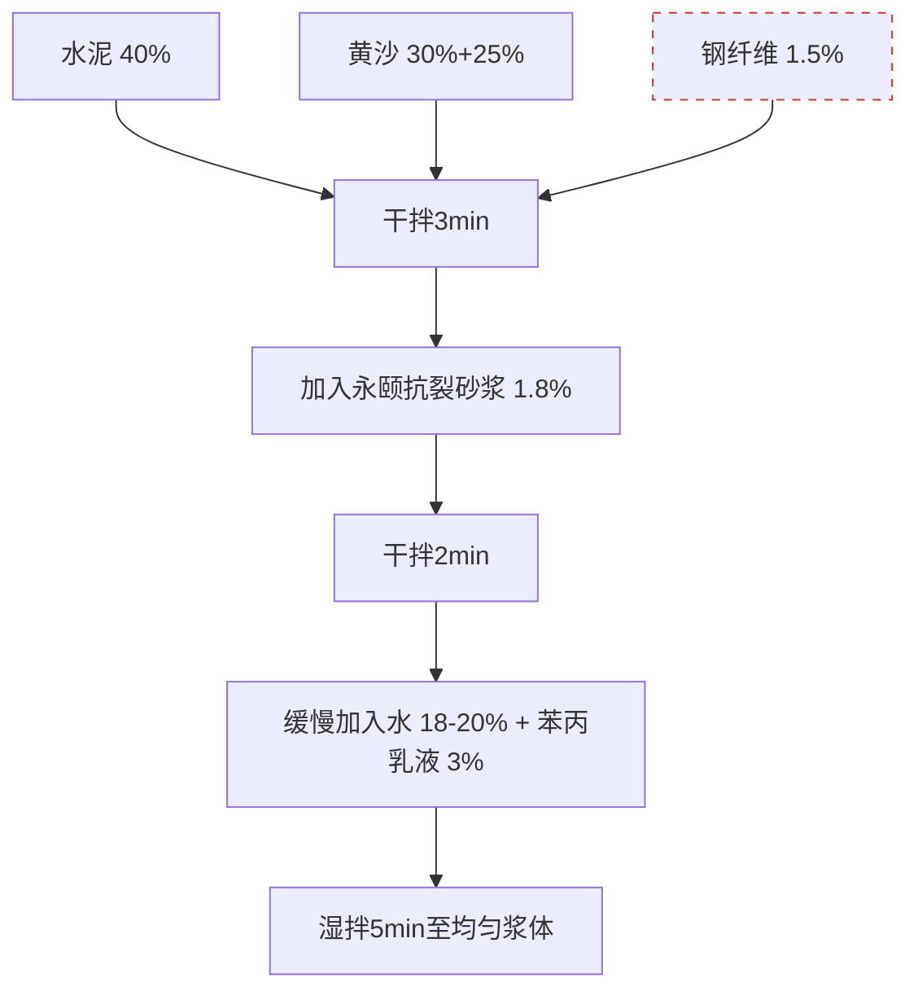
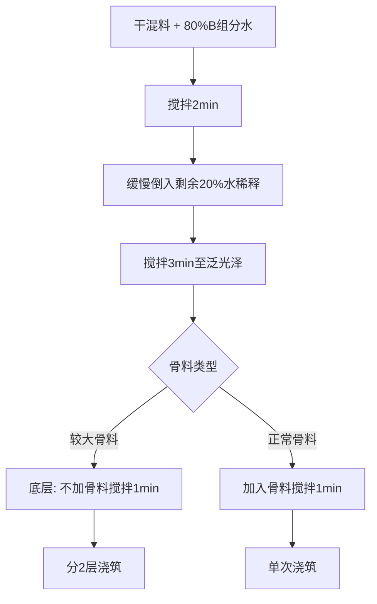
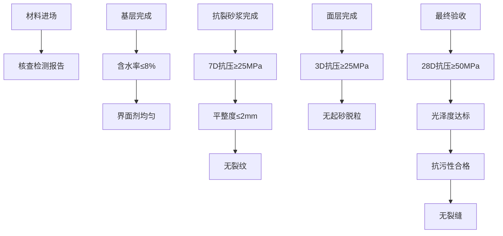
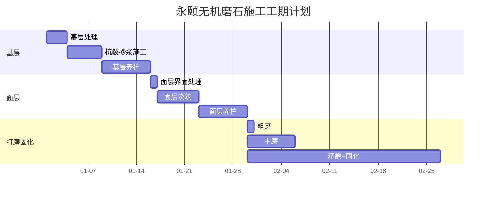
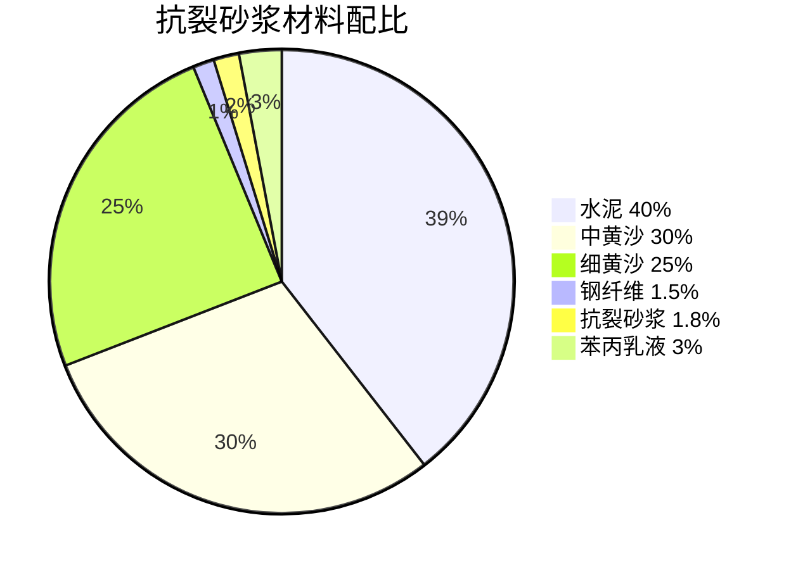

# 施工流程图汇总

## 1. 总体施工流程

```mermaid
graph LR
    A[基层处理] --> B[抗裂砂浆浇筑]
    B --> C[养护7天]
    C --> D[面层界面处理]
    D --> E[面层浇筑]
    E --> F[养护7天]
    F --> G[粗磨 60目]
    G --> H[中磨 150→500目]
    H --> I[精磨 1000→3000目]
    I --> J[密封固化]
    
    style A fill:#e1f5fe,stroke:#01579b
    style B fill:#fff3e0,stroke:#e65100
    style C fill:#e8f5e9,stroke:#1b5e20
    style D fill:#e1f5fe,stroke:#01579b
    style E fill:#fff3e0,stroke:#e65100
    style F fill:#e8f5e9,stroke:#1b5e20
    style G fill:#f3e5f5,stroke:#4a148c
    style H fill:#f3e5f5,stroke:#4a148c
    style I fill:#f3e5f5,stroke:#4a148c
    style J fill:#fff9c4,stroke:#f57f17
```

## 2. 抗裂砂浆搅拌流程

```mermaid
graph TD
    A[水泥 40%] --> D[干拌3min]
    B[黄沙 30%+25%] --> D
    C[钢纤维 1.5%] --> D
    D --> E[加入永颐抗裂砂浆 1.8%]
    E --> F[干拌2min]
    F --> G[缓慢加入水 18-20% + 苯丙乳液 3%]
    G --> H[湿拌5min至均匀浆体]
    
    style C stroke:#d32f2f,stroke-dasharray: 5 5
```

> **注意**: 钢纤维需分3次加入，防止结团。浆体扩展度控制160-180mm。

## 3. 面层材料搅拌流程

```mermaid
graph TD
    A[干混料 + 80%B组分水] --> B[搅拌2min]
    B --> C[缓慢倒入剩余20%水稀释]
    C --> D[搅拌3min至泛光泽]
    D --> E{骨料类型}
    E -->|较大骨料| F[底层: 不加骨料搅拌1min]
    E -->|正常骨料| G[加入骨料搅拌1min]
    F --> H[分2层浇筑]
    G --> I[单次浇筑]
```

## 4. 验收流程

```mermaid
graph TD
    A[材料进场] --> A1[核查检测报告]
    B[基层完成] --> B1[含水率≤8%]
    B1 --> B2[界面剂均匀]
    C[抗裂砂浆完成] --> C1[7D抗压≥25MPa]
    C1 --> C2[平整度≤2mm]
    C2 --> C3[无裂纹]
    D[面层完成] --> D1[3D抗压≥25MPa]
    D1 --> D2[无起砂脱粒]
    E[最终验收] --> E1[28D抗压≥50MPa]
    E1 --> E2[光泽度达标]
    E2 --> E3[抗污性合格]
    E3 --> E4[无裂缝]
```

## 5. 工期甘特图

```mermaid
gantt
    title 永颐无机磨石施工工期计划
    dateFormat  YYYY-MM-DD
    axisFormat  %m-%d
    
    section 基层
    基层处理           :a1, 2024-01-01, 3d
    抗裂砂浆施工       :a2, after a1, 5d
    基层养护           :a3, after a2, 7d
    
    section 面层
    面层界面处理       :b1, after a3, 1d
    面层浇筑           :b2, after b1, 6d
    面层养护           :b3, after b2, 7d
    
    section 打磨固化
    粗磨               :c1, after b3, 1d
    中磨               :c2, after b3, 7d
    精磨+固化          :c3, after b3, 28d
```

## 6. 材料配比饼图（示意）

```mermaid
pie title 抗裂砂浆材料配比
    "水泥 40%" : 40
    "中黄沙 30%" : 30
    "细黄沙 25%" : 25
    "钢纤维 1.5%" : 1.5
    "抗裂砂浆 1.8%" : 1.8
    "苯丙乳液 3%" : 3
```
