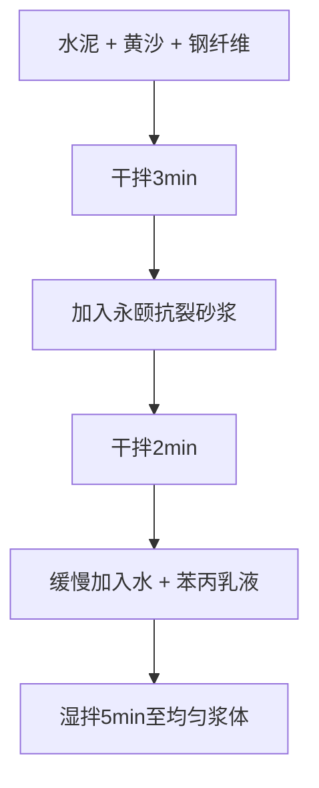

# 基层抗裂砂浆施工方案

## 1. 基层处理

### 1.1 施工步骤

| 步骤 | 操作内容 | 技术要求 |
|------|---------|---------|
| 清理基层 | 清除浮灰、油污，修补裂缝 | ≥1mm裂缝需注浆处理 |
| 湿润基层 | 施工前2小时洒水湿润 | 无明水后涂刷界面剂 |
| 弹线分格 | 按设计分割间距弹线 | 间距≤8m×8m |
| 预留伸缩缝 | 预留伸缩缝 | 宽5mm，深20mm |

> **工艺选择**: 超过100mm抗裂砂浆采用**悬浮工艺**，少于100mm建议**粘贴法工艺**

### 1.2 界面剂涂刷

| 项目 | 参数 |
|------|------|
| 用量 | 0.3 kg/m² |
| 涂刷后静置 | 30min |
| 漏刷处理 | 补刷后静置30min |

### 1.3 基层验收标准

| 检测项目 | 标准 | 检测方法 |
|---------|------|---------|
| 含水率 | ≤8% | 1m²塑料膜覆盖24h无水珠 |
| 界面剂均匀性 | 无漏刷 | 目测 |

---

## 2. 材料搅拌

### 2.1 钢纤维抗裂砂浆配方（50mm厚）

| 名称 | 型号/规格 | 用量比例 |
|------|-----------|---------|
| 硅酸盐水泥 | 42.5 | 40% |
| 中号黄沙 | 0.3-1.2mm | 30% |
| 细黄沙 | 40~70目 | 25% |
| 钢纤维 | 剪切型 | 1.5% |
| 永颐抗裂砂浆 | YYKLSJ-05 | 1.8% |
| 苯丙乳液 | 固含量50±1% | 3% |
| 水 | - | 18-20% |

### 2.2 搅拌顺序

### 2.3 搅拌注意事项

- **钢纤维**需分3次加入，防止结团
- 浆体**扩展度控制**：160-180mm（流动度仪检测）

---

## 3. 浇筑与整平

### 3.1 施工步骤

| 步骤 | 操作 | 要求 |
|------|------|------|
| 摊铺 | 永颐高精找平机器人找平 | 整体误差≤2mm |
| 表面整平 | 边角刮杠刮平 → 磨光机收光 | 初凝前完成 |
| 切缝处理 | 切割伸缩缝 | 终凝后24h内完成 |

### 3.2 环境控制

| 参数 | 要求 |
|------|------|
| 环境温度 | 5~30℃ |
| 高温措施 | 遮阳防暴晒 |
| 终凝时间 | 约4~6小时（缓凝剂调节） |

---

## 4. 养护

### 4.1 养护方法

| 项目 | 方法 |
|------|------|
| 覆膜养护 | 浇筑后2h覆盖PE膜 |
| 喷水保湿 | 保持湿润7天 |
| 冬季保温 | ≥5℃ |
| 夏季控温 | 避免温差过大 |

### 4.2 验收标准

| 指标 | 标准 |
|------|------|
| 7D抗压强度 | ≥25 MPa |
| 表面裂纹 | 无（允许宽度≤0.2mm） |
