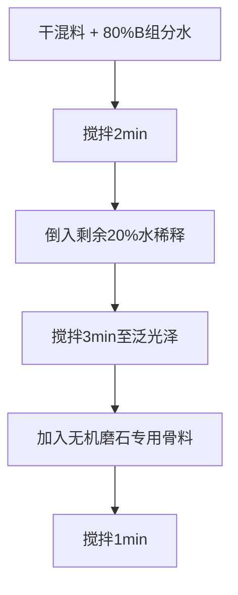

# 面层磨石施工方案

## 1. 界面处理

### 1.1 基层检查

| 检测项目 | 标准 |
|---------|------|
| 基层抗压强度 | ≥20 MPa |
| 含水率 | ≤6% |

### 1.2 界面剂涂刷

| 项目 | 参数 |
|------|------|
| 涂刷方式 | 滚涂2遍 |
| 间隔时间 | 间隔2h |
| 用量 | 0.4 kg/m² |
| 固化要求 | 完全固化（触干时间≤4h）后再施工面层 |

---

## 2. 面层材料搅拌

### 2.1 搅拌顺序

### 2.2 配比参数

| 参数 | 数值 |
|------|------|
| 水胶比 | 12-16% |
| B组分（水）加入方式 | 先加80%，剩余20%后加 |

> **注意**: 无机磨石专用骨料仅限底层浆体加入

---

## 3. 浇筑与密实

### 3.1 浇筑方式

| 骨料类型 | 浇筑方式 | 说明 |
|---------|---------|------|
| 较大骨料（5-8mm） | 分2层浇筑 | 底层6mm无大骨料 + 面层6mm含骨料 |
| 正常骨料 | 单次浇筑 | - |

### 3.2 施工工艺

| 步骤 | 操作 | 要求 |
|------|------|------|
| 底层 | 清理地面，保持湿润 | 不宜过大面积施工 |
| 面层 | 摊铺机器人摊铺 | 整体误差1~2mm |
| 收光 | 边角初凝前镘刀收光2次 | 消除表面气孔 |

### 3.3 注意事项

| 项目 | 要求 |
|------|------|
| 层间间隔 | ≤1h，避免冷接缝 |
| 环境湿度 | ≤70%，防止表面泌水 |

---

## 4. 养护管理

| 项目 | 方法 |
|------|------|
| 覆膜养护 | 浇筑后4h覆盖无纺布 + PE膜 |
| 喷水养护 | 3~7天 |
| 温度控制 | 恒温20±5℃，避免骤冷骤热 |

### 4.2 验收标准

| 指标 | 标准 |
|------|------|
| 3D抗压强度 | ≥25 MPa |
| 表面质量 | 无起砂、脱粒 |

---

## 5. 打磨抛光

### 5.1 打磨流程

| 阶段 | 时机 | 磨片目数 | 目标 |
|------|------|---------|------|
| 粗磨 | 24h后 | 60目金刚石 | 去除浮浆，暴露骨料30% |
| 中磨 | 7天后 | 150目 → 500目 | 消除划痕 |
| 精磨 | 28天后 | 1000目 → 3000目 | 表面粗糙度Ra≤0.2μm |

### 5.2 注意事项

| 项目 | 要求 |
|------|------|
| 打磨深度 | ≤3mm，避免骨料脱落 |
| 边角处理 | 手工精磨，防止机器啃边 |

---

## 6. 密封固化

### 6.1 材料

- **固化剂**: 水性锂基固化剂
- **罩面剂**: 永颐纳米二氧化硅罩面剂

### 6.2 施工工艺

| 步骤 | 操作 | 参数 |
|------|------|------|
| 滚涂固化剂 | 2遍 | 间隔4h，用量0.25kg/m² |
| 抛光 | 固化48h后 | 高速抛光机1500rpm + 白色垫片 |
| 罩面（可选） | 喷涂纳米二氧化硅 | 用量0.1kg/m²，光泽度↑至70GU |

### 6.3 验收标准

| 检测项 | 标准 | 检测方法 |
|--------|------|---------|
| 抗污性 | 咖啡/酱油24h不渗透 | GB/T 3810.14 |
| 光泽度（未罩面） | 60°角 ≥40 GU | GB/T 13891 |
| 光泽度（罩面） | 60°角 ≥70 GU | GB/T 13891 |
