# 施工顺序与关键节点

## 1. 施工流程图

```mermaid
graph LR
    A[基层处理] --> B[抗裂砂浆浇筑]
    B --> C[养护7天]
    C --> D[面层界面处理]
    D --> E[面层浇筑]
    E --> F[养护7天]
    F --> G[粗磨 - 24h后60目]
    G --> H[中磨 - 7天后150→500目]
    H --> I[精磨 - 28天后1000→3000目]
    I --> J[密封固化]
    
    style A fill:#e1f5fe
    style B fill:#fff3e0
    style C fill:#e8f5e9
    style D fill:#e1f5fe
    style E fill:#fff3e0
    style F fill:#e8f5e9
    style G fill:#f3e5f5
    style H fill:#f3e5f5
    style I fill:#f3e5f5
    style J fill:#fff9c4
```

## 2. 工期排布

| 天数 | 阶段 | 工作内容 |
|:----:|------|---------|
| D1-D3 | 基层处理 | 清理、修补、弹线、界面处理 |
| D4-D8 | 抗裂砂浆施工 | 搅拌、浇筑、整平、切缝 |
| D9-D15 | 基层养护 | 覆膜喷水养护7天 |
| D16 | 面层界面处理 | 检查基层、涂刷界面剂 |
| D17-D22 | 面层施工 | 搅拌、浇筑、收光 |
| D23-D29 | 面层养护 | 覆膜养护7天 |
| D30 | 粗磨 | 60目金刚石磨片 |
| D36+ | 中磨 | 150目→500目 |
| D57+ | 精磨 | 1000目→3000目（28天后） |
| D58+ | 密封固化 | 固化剂2遍→抛光→罩面 |

## 3. 关键节点控制

### 3.1 时间控制

| 节点 | 要求 | 说明 |
|------|------|------|
| 基层养护 | 7天 | 抗压≥25MPa |
| 面层养护 | 7天 | 3D抗压≥25MPa |
| 精磨间隔 | 28天 | 保证强度充分发展 |
| 层间间隔 | ≤1h | 避免冷接缝 |
| 终凝切缝 | 终凝后24h内 | 切割伸缩缝 |

### 3.2 环境控制

| 参数 | 要求 |
|------|------|
| 施工温度 | 5~30℃ |
| 环境湿度 | 40~70% |
| 面层湿度 | ≤70% |

### 3.3 质量停检点

1. **基层处理完成** → 检查含水率≤8%
2. **抗裂砂浆养护完成** → 检查7D抗压≥25MPa，无裂纹
3. **面层界面处理** → 检查基层抗压≥20MPa，含水率≤6%
4. **面层养护完成** → 检查3D抗压≥25MPa，无起砂脱粒
5. **精磨完成** → 检查粗糙度Ra≤0.2μm
6. **密封固化完成** → 检查光泽度和抗污性
