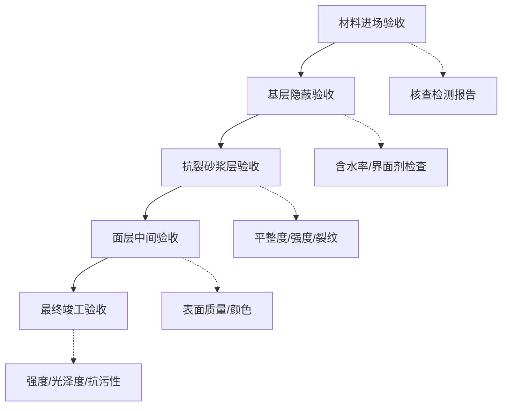

# 施工验收文档

## 1. 必检文件清单

| 序号 | 文件名称 | 说明 |
|:----:|---------|------|
| 1 | 材料检测报告 | 水泥、骨料、颜料第三方认证 |
| 2 | 现场取芯强度报告 | 28D抗压≥50MPa |
| 3 | 伸缩缝处理照片 | 宽度、深度、填充材料记录 |
| 4 | 施工日志 | 每日施工记录 |
| 5 | 隐蔽工程验收记录 | 基层处理、界面处理等 |
| 6 | 环境监测记录 | 温度、湿度记录 |

## 2. 各阶段验收标准

### 2.1 基层验收

| 检查项 | 标准 | 检测方法 |
|--------|------|---------|
| 基层含水率 | ≤8% | 塑料膜覆盖法 |
| 界面剂涂刷 | 均匀无漏刷 | 目测 |
| 分格缝 | 间距≤8m×8m | 尺量 |
| 伸缩缝 | 宽5mm，深20mm | 尺量 |

### 2.2 抗裂砂浆层验收

| 检查项 | 标准 | 检测方法 |
|--------|------|---------|
| 平整度 | 整体误差≤2mm | 2m靠尺 |
| 7D抗压强度 | ≥25MPa | 取芯检测 |
| 表面裂纹 | 无（允许≤0.2mm） | 目测+塞尺 |

### 2.3 面层验收

| 检查项 | 标准 | 检测方法 |
|--------|------|---------|
| 平整度 | 整体误差1~2mm | 2m靠尺 |
| 3D抗压强度 | ≥25MPa | 取芯检测 |
| 表面质量 | 无起砂、脱粒 | 目测 |
| 颜色均匀性 | 均匀一致 | 目测 |

### 2.4 最终验收

| 检查项 | 标准 | 检测方法 |
|--------|------|---------|
| 28D抗压强度 | ≥50MPa | GB/T 50081 |
| 光泽度（未罩面） | 60°角 ≥40GU | GB/T 13891 |
| 光泽度（罩面） | 60°角 ≥70GU | GB/T 13891 |
| 抗污性 | 咖啡/酱油24h不渗透 | GB/T 3810.14 |
| 表面粗糙度 | Ra≤0.2μm | 粗糙度仪 |
| 整体裂缝 | 无裂缝 | 目测 |

## 3. 验收流程

